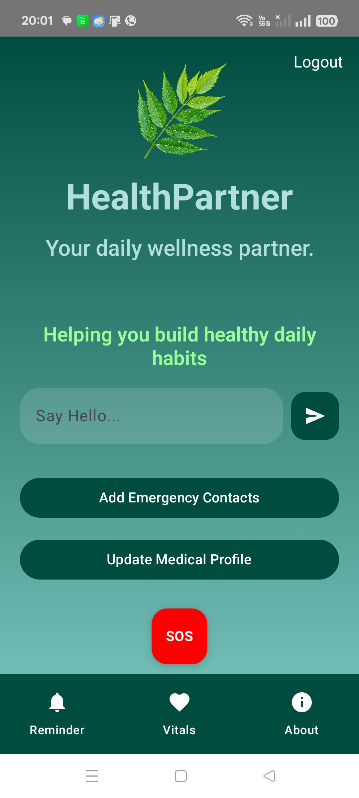
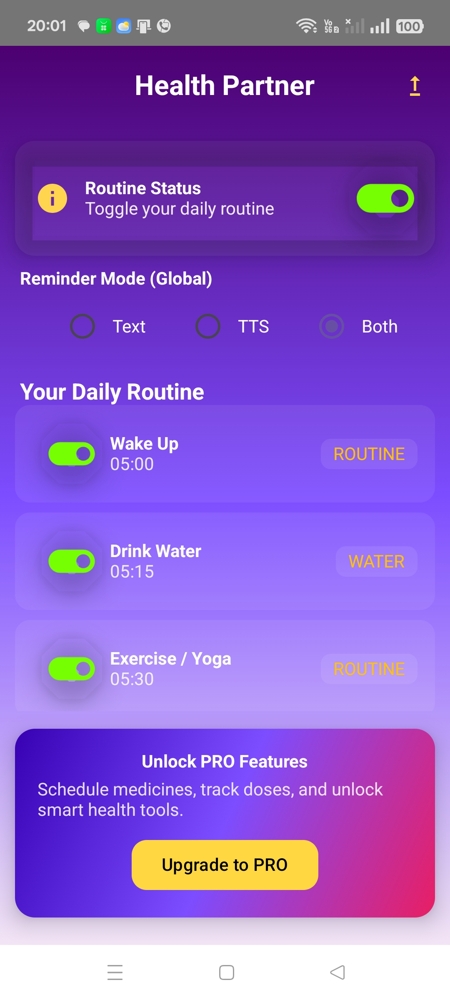

# ❤️ HealthPartner

## Your Personal Healthcare Companion

HealthPartner is a modern Android healthcare application developed by **ZENVYRA** to help users build healthier daily habits through AI-powered assistance, smart reminders, natural wellness guidance, health record management, and emergency protection.

Designed with **Kotlin**, **Jetpack Compose**, **MVVM**, and **Clean Architecture**, HealthPartner provides a clean, intuitive, and reliable healthcare experience.

---

## 🌟 Key Highlights

- 🤖 AI Health Assistant
- 🌿 Natural Remedies & Wellness Tips
- ⏰ Smart Daily Reminder
- 💊 Medicine Reminder
- 📊 Health Record Management
- 🚑 Emergency SOS
- 👨‍⚕️ Medical Profile
- 👥 Emergency Contacts
- 💎 Premium Subscription
- 🎨 Modern Material 3 UI

---

## 🛠 Technology Stack

| Category | Technology |
|----------|------------|
| Language | Kotlin |
| UI | Jetpack Compose |
| Architecture | MVVM + Clean Architecture |
| Database | Room Database |
| Preferences | DataStore |
| Networking | Retrofit + OkHttp |
| Background Tasks | WorkManager |
| Billing | Google Play Billing |
| Location | Google Play Location Services |

---

# 📸 Application Preview

## 🏠 Home Dashboard



---

## ⏰ Smart Reminder



---

# ✨ Features

## 🤖 AI Health Assistant

- Interactive AI-powered health assistant
- Ask health-related questions
- User-friendly chat interface
- Quick health guidance

---

## 🌿 Natural Remedies & Wellness Tips

- Daily wellness tips
- Natural healthcare guidance
- Healthy lifestyle recommendations
- Preventive healthcare information

---

## ⏰ Smart Reminder System

Stay consistent with healthy habits through customizable reminders.

Supports reminders for:

- 💊 Medicines
- 🥣 Breakfast
- 🍛 Lunch
- 🍽️ Dinner
- 💧 Water Intake
- 🚶 Walking
- 🏃 Exercise
- 😴 Sleep
- 📝 Custom Activities

---

## 📊 Health Record Management

Manage important medical information in one place.

Supports records for:

- Blood Pressure
- Blood Sugar
- Cholesterol
- Thyroid
- Hemoglobin
- BMI
- Other Medical Test Reports

---

## 🚑 Emergency Assistance

Built-in emergency tools to help users during critical situations.

Includes:

- Emergency SOS
- Emergency Contacts
- Personal Medical Profile

---

## 💎 Premium Features

Unlock additional capabilities through Google Play subscriptions.

---

## 🎨 Modern User Experience

- Material 3 Design
- Smooth Jetpack Compose UI
- Easy Navigation
- Clean & Responsive Layout

  ---

# 🏗 Architecture

HealthPartner follows modern Android development practices to ensure scalability, maintainability, and clean code.

### Architecture Pattern

- MVVM (Model–View–ViewModel)
- Clean Architecture
- Repository Pattern
- Kotlin Coroutines
- StateFlow
- Dependency Separation

---

# 📂 Project Structure

```text
com.healthpartner.app
│
├── data
│   ├── database
│   ├── repository
│   ├── reminder
│   ├── sos
│   └── preferences
│
├── nav
│
├── ui
│   ├── onboarding
│   ├── reminder
│   ├── sos
│   ├── tips
│   ├── chat
│   └── profile
│
├── util
│
├── viewmodel
│
└── MainActivity
```

---

# 🛠 Built With

- Kotlin
- Jetpack Compose
- Material 3
- MVVM Architecture
- Room Database
- DataStore
- Retrofit
- OkHttp
- WorkManager
- Google Play Billing
- Google Play Location Services
- AdMob
- Android Studio

---

# 💡 Why HealthPartner?

HealthPartner is designed to encourage preventive healthcare through daily wellness management rather than focusing only on illness tracking.

The application combines AI assistance, natural health guidance, smart reminders, emergency protection, and personal health record management into one modern Android experience.

Key objectives include:

- Encourage healthy daily habits
- Improve medication adherence
- Organize personal health information
- Provide quick emergency access
- Deliver a simple and intuitive user experience

  ---

# 🚀 Roadmap

HealthPartner is actively being improved with new features planned for future releases.

### Planned Features

- 🤖 AI-powered personalized health recommendations
- 📈 Advanced health analytics and trends
- ☁️ Cloud backup & synchronization
- 👨‍👩‍👧 Family health management
- 📅 Doctor appointment scheduling
- 📄 Digital prescription management
- 📷 Prescription OCR scanner
- ⌚ Wearable device integration
- 🌍 Multi-language support

---

# 📱 Current Status

> **Google Play Closed Testing**

HealthPartner is currently under **Google Play Closed Testing**, where features are being tested and refined to ensure a stable, secure, and user-friendly experience before public release.

---

# 👨‍💻 Developed By

### ZENVYRA

Building modern software solutions for businesses and consumers.

Current Products:

- ❤️ HealthPartner
- 💼 ZENVYRA Workforce ERP
- 🎓 TinySteps Kids

---

# 📬 Contact

📧 Email  
**palash.zenvyra@gmail.com**

💼 LinkedIn  
https://linkedin.com/in/palash-bhowmik-0943a7423

🐙 GitHub  
https://github.com/PalashBhowmik

---

# ⭐ Support

If you like this project, please consider giving it a ⭐ on GitHub.

Your support motivates continued development and helps others discover the project.

---

## © 2026 ZENVYRA

Building modern Android and Desktop applications with **Kotlin**, **Jetpack Compose**, and **Compose Multiplatform**.

| IDE | Android Studio |

---
